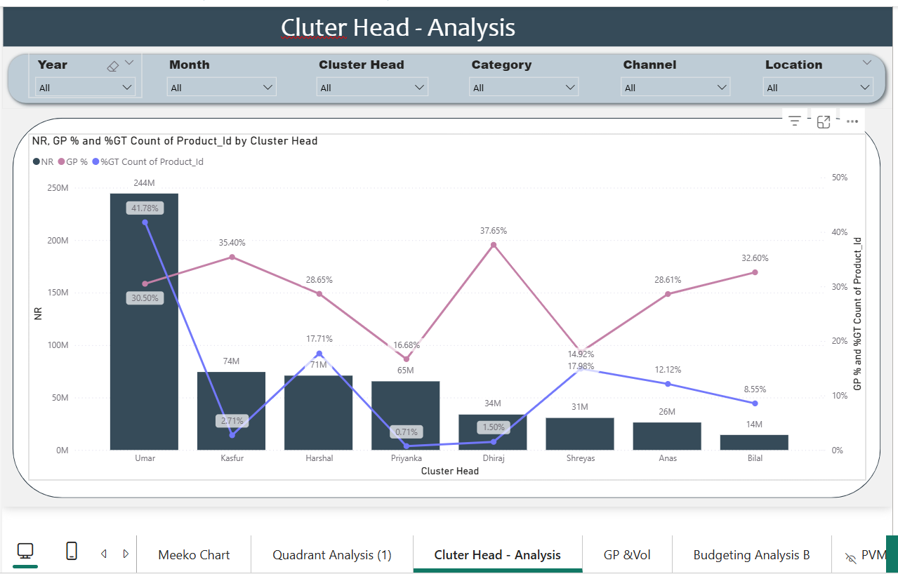

# fastfood-financial-optimization-excel-powerbi

# 🍔 Crunchy Corner: Strategic Business Intelligence & Financial Optimization

A comprehensive **Business Intelligence & Financial Analytics** project built for **Crunchy Corner**, a multi-location fast-food enterprise. This project transforms raw operational and financial data into actionable business insights, enabling better decision-making through interactive Power BI dashboards and advanced financial analysis.

---

## 📌 Project Overview

Crunchy Corner managed over **1,360+ SKUs** across multiple regional clusters but faced challenges due to fragmented operational and financial data.

This project centralizes data from multiple sources to provide a unified analytical platform for monitoring profitability, operational efficiency, leadership performance, and financial forecasting.

### 🎯 Business Objectives

- Compare **Budgeted Net Revenue (B NR)** with **Actual Net Revenue (NR)**
- Perform **Price-Volume-Mix (PVM)** analysis to identify revenue drivers
- Evaluate **Cluster Head** performance using KPI benchmarking
- Optimize menu performance using **Pareto (80/20)** and **Quadrant Analysis**
- Improve profitability through cost and variance analysis

---

# 🛠️ Tech Stack

- **Microsoft Excel** – Data cleaning, financial modeling, and DAX preparation
- **Power BI** – Interactive dashboard development (8-page dashboard suite)
- **Power Query** – ETL process and data transformation
- **Data Modeling** – Star Schema
- **Analytical Frameworks**
  - Price Volume Mix (PVM)
  - Variance Analysis
  - Pareto (80/20) Analysis
  - Menu Engineering

---

# 📊 Dashboard Modules

## 1. Financial & Budget Variance

Created a financial monitoring system that compares budgeted and actual performance.

### Key Insights

- **UP** emerged as the highest revenue-generating region with **$5.1M Net Revenue**
- **Karnataka** and **Calcutta** recorded approximately **-14.8% YoY variance**, highlighting areas requiring operational improvements

---

## 2. Price-Volume-Mix (PVM) Analysis

A Waterfall Chart was used to explain changes in total Net Revenue.

### Findings

- **Total Net Revenue:** **$10.40M**
- **Volume Effect:** **+537K**
- **Price Effect:** **-199K**

The analysis indicates customer growth through increased sales volume while aggressive pricing strategies reduced revenue gains.

---

## 3. Cluster Head Performance Analysis

Evaluated leadership effectiveness across regional business clusters.

### Highlights

- Performance comparison against assigned budgets
- YoY growth tracking by manager
- Identification of high-performing leadership strategies

Example:

- **Dhiraj** achieved approximately **506% YoY growth** in selected product categories.

---

## 4. Cost & Profitability Analysis

Built a Cost Funnel illustrating the complete flow from Revenue to Profit.

### Major Findings

- Raw Material (RM) costs consistently account for approximately **50%** of revenue.
- **Protein Pack** maintains the strongest margin-to-volume ratio, making it the business's primary **Star Product**.

---

# 🚀 Key Features

- Interactive 8-page Power BI dashboard
- Financial Performance Dashboard
- Cost Analysis Dashboard
- Budget Variance Dashboard
- Price-Volume-Mix (PVM) Dashboard
- Meeko Chart Analysis
- Dynamic KPI thresholds with color-coded performance indicators
- Pareto (80/20) visualization for SKU optimization
- Geographic revenue and profitability analysis
- Regional leadership performance tracking

---

# 📈 Business Insights

### Category Performance

- **Protein Pack** contributes **34.96%** of total revenue and remains the highest-performing category.

### Cost Optimization

Significant post-production costs originate from:

- Logistics
- Sales & Distribution
- Marketing

These areas present opportunities for operational optimization and route planning.

### Financial Highlights

- **Net Revenue:** $10.40M
- **EBITDA:** $1.62M
- **PAT:** $1.29M

---

# 📷 Dashboard Preview

Add your dashboard screenshots inside an `images/` folder and update the paths below.

## Performance Dashboard


---

## Price Volume Mix Dashboard


---

## Cluster Head Dashboard



---

## Cost Analysis Dashboard


---

# 💡 Challenges Solved

### Large Dataset Optimization

Handled a dataset containing **1,360+ SKUs** while maintaining smooth Power BI performance and responsive slicers.

### Metric Standardization

Standardized Gross Profit calculations across multiple product categories to ensure consistent and comparable financial reporting.

---

# 🔮 Future Improvements

- AI-powered forecasting using **Power BI Key Influencers**
- Real-time inventory integration through Excel live connections
- Automated wastage tracking dashboard
- Predictive Profit After Tax (PAT) modeling
- Hindi YouTube walkthrough explaining dashboard design and DAX implementation

---

# 📂 Project Structure

```
Crunchy-Corner-BI/
│
├── Dashboard.pbix
├── Data/
├── Images/
├── Documentation/
└── README.md
```

---

# 📬 Contact

**Sumit Gupta**

**Data Analyst | Power BI Developer | Automation Expert**

📍 Mumbai, India

💼 Open to Data Analytics, Business Intelligence, and Automation opportunities.

---

## ⭐ If you found this project useful, consider giving it a Star!
```
